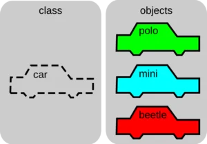
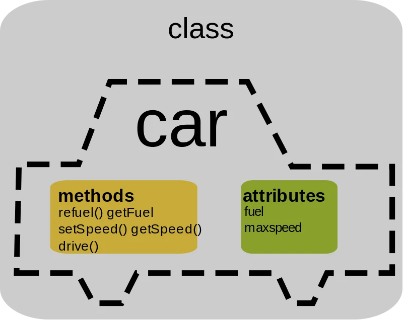
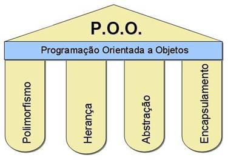

# 📘 Apostila 1 — Introdução à Programação Orientada a Objetos com Java

## O que é um Paradigma de Programação?

Antes de aprender Programação Orientada a Objetos (POO), precisamos entender o que é um paradigma de programação.

Um paradigma de programação é uma forma de estruturar e organizar o código de um programa.  
Ele define como os problemas serão resolvidos através da programação.

Em outras palavras, um paradigma é uma maneira de pensar a lógica do programa.

Cada paradigma possui suas próprias regras, conceitos e formas de organizar o código.

---

## -> Exemplos de Paradigmas de Programação

Existem vários paradigmas de programação. Alguns dos principais são:

- Programação Procedural
- Programação Orientada a Objetos
- Programação Funcional
- Programação Lógica

Neste material iremos focar na Programação Orientada a Objetos, que é o paradigma utilizado pela linguagem Java.

---

## Programação Procedural

Na programação procedural, o programa é organizado em funções ou procedimentos que executam tarefas específicas.

O foco está na sequência de passos que o programa executa.

### Exemplo simples em Java

```java
public class ExemploProcedural {

    public static int somar(int a, int b) {
        return a + b;
    }

    public static void main(String[] args) {

        int resultado = somar(5, 3);

        System.out.println("Resultado: " + resultado);

    }
}
```

Nesse exemplo:

- Criamos uma função chamada somar

- O programa executa essa função

- O resultado é exibido na tela

Nesse modelo, o código gira em torno de funções que manipulam dados.

## O que é Programação Orientada a Objetos?
A Programação Orientada a Objetos (POO) é um paradigma que organiza o código utilizando objetos.
Esses objetos representam elementos do mundo real, como pessoas, carros, produtos, contas bancárias, alunos...



Cada objeto possui:

- atributos → características

- métodos → comportamentos

Esses objetos são criados a partir de classes.



## Os Pilares da Programação Orientada a Objetos
A Programação Orientada a Objetos é baseada em quatro princípios fundamentais, conhecidos como pilares da POO.
Esses pilares ajudam a organizar melhor o código, tornando os sistemas mais reutilizáveis, flexíveis e fáceis de manter.

Os quatro pilares são:

- Abstração  
- Encapsulamento  
- Herança  
- Polimorfismo  

Nos próximos capítulos da apostila, cada um desses conceitos será estudado com mais profundidade.



---

##  Abstração

A abstração consiste em representar apenas as características essenciais de um objeto, ignorando detalhes desnecessários.

Ou seja, focamos apenas no que é importante para o funcionamento do sistema.

Exemplo:  
Em um sistema de banco, uma classe `ContaBancaria` pode ter métodos como:

- sacar()
- depositar()
- consultarSaldo()

O usuário do sistema não precisa saber como o sistema calcula ou armazena o saldo internamente, apenas utilizar essas operações.

---

##  Encapsulamento

O encapsulamento consiste em proteger os dados de uma classe, controlando como eles podem ser acessados ou modificados.

Isso é feito utilizando modificadores de acesso, como:

- `private`
- `public`
- `protected`

Exemplo em Java:

```java
public class ContaBancaria {

    private double saldo;

    public void depositar(double valor) {
        saldo += valor;
    }

}
```
Nesse caso, o atributo saldo não pode ser alterado diretamente por outras classes.

## Herança
A herança permite que uma classe herde características e comportamentos de outra classe.
Isso promove reutilização de código.

Exemplo:
```java
public class Animal {

    void emitirSom() {
        System.out.println("O animal fez um som");
    }

}
```

```java
public class Cachorro extends Animal {
    //Vai ter acesso a emitirSom
}
```
A classe Cachorro herda o comportamento da classe Animal.

## Polimorfismo
O polimorfismo permite que um mesmo método tenha comportamentos diferentes dependendo do objeto que o utiliza.

Exemplo:
```java
public class Animal {

    void emitirSom() {
        System.out.println("Som de animal");
    }

}
```

```java
public class Cachorro extends Animal {

    @Override
    void emitirSom() {
        System.out.println("Latido");
    }

}
```

```java
public class Gato extends Animal {

    @Override
    void emitirSom() {
        System.out.println("Miau");
    }

}
```
O método emitirSom() existe em todas as classes, mas cada uma possui um comportamento diferente.  

### Resumo:

| Pilar          | Descrição                                     |
| -------------- | --------------------------------------------- |
| Abstração      | Representar apenas o essencial                |
| Encapsulamento | Proteger e controlar acesso aos dados         |
| Herança        | Reutilizar código entre classes               |
| Polimorfismo   | Um mesmo método com comportamentos diferentes |
