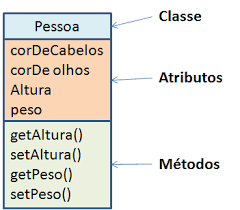

# 📘 Apostila 2 — Classes, atributos e métodos

## O que é uma Classe?
Uma classe é um modelo utilizado para criar objetos

Ela define:

- atributos → características do objeto  
- métodos → comportamentos do objeto  



Podemos pensar em uma classe como um molde, que define como os objetos serão criados


## O que são Atributos?
Os atributos representam as características de um objeto.
Eles são as variáveis declaradas dentro de uma classe e servem para armazenar informações sobre o objeto.

Por exemplo, se tivermos uma classe `Pessoa`, alguns atributos poderiam ser:
- nome
- idade
- altura

Esses atributos descrevem as características de uma pessoa.

Exemplo:
```java
public class Pessoa {

    String nome;
    int idade;

}
```
Nesse exemplo temos a seguinte estrutura:
- Criamos uma classe Pessoa
- Nome e idade são caracteristicas de uma pessoa, logo, esses serão os atributos
- A classe define quais características um objeto do tipo Pessoa terá


## O que são Métodos?   
Os métodos representam as ações que um objeto pode executar. Eles definem comportamentos para a classe.
Em Java, um método é basicamente uma função que pertence a uma classe

### Estrutura de um método
A estrutura básica de um método em Java é:

```java
tipoRetorno nomeMetodo(parametros) {
    // código
}
```

```java
public class Pessoa {

    String nome;
    int idade;

    void dizerOi() {
        System.out.println("Oi!");
    }

}
```

Nesse caso:
- Void é o tipo que indica que o método não tem retorno
- dizerOi é o nome do método que representa uma ação/comportamento

## Utilizando uma classe
Para usar a classe, precisamos criar um objeto dela.

```java
public class Programa {

    public static void main(String[] args) {

        Pessoa pessoa1 = new Pessoa();
        //Crio um objeto do tipo Pessoa e logo em seguida digo que ela vai armazenar uma nova pessoa

        pessoa1.nome = "Ana";
        //Dou um valor para o atributo nome
        pessoa1.idade = 25;
        //Dou um valor para o atributo idade

        pessoa1.apresentar();
        //Chamo o método que vai exibir "Oi!" no terminal

    }

}
```

## Métodos com Parâmetros
Um método também pode receber valores como entrada, chamados de parâmetros.

```java
public class Pessoa {

    void dizerOi(String nome) {
        System.out.println("Oi," + " " + nome);
    }

}
```
```java
public class Programa {

    public static void main(String[] args) {

        Pessoa pessoa1 = new Pessoa();

        pessoa1.apresentar("Tífani");
        //Chamo o método que vai exibir "Oi, Tífani " no terminal

    }

}
```


