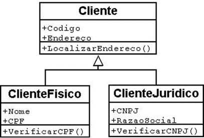

# 📘 Apostila 5 — Herança

## O que é Herança?
A herança é um dos pilares da Programação Orientada a Objetos.

Ela permite que uma classe herde atributos e métodos de outra classe, evitando repetição de código e facilitando a reutilização.

A classe que fornece os atributos e métodos é chamada de:
- **Superclasse** (ou classe pai)

A classe que herda essas características é chamada de:

- **Subclasse** (ou classe filha)



---

## Como funciona a Herança em Java
Em Java, utilizamos a palavra-chave **`extends`** para indicar que uma classe herda de outra.

Estrutura básica:

```java
class ClasseFilha extends ClassePai {

}
```

## Exemplo simples de Herança
Classe pai:
```java
public class Animal {

    String nome;

    void emitirSom() {
        System.out.println("O animal fez um som");
    }

}
```

Classe filho:
```java
public class Cachorro extends Animal {
    //Herda o atributo nome
    //Tem acesso ao método emitirSom
}
```

Nesse exemplo:

- Animal é a superclasse
- Cachorro é a subclasse

A classe Cachorro automaticamente herda:

- o atributo nome
- o método emitirSom()

## Utilizando a Herança
```java
public class Programa {

    public static void main(String[] args) {

        Cachorro cachorro = new Cachorro();

        cachorro.nome = "Rex";
        cachorro.emitirSom();

    }

}
```
- Mesmo sem declarar nada na classe Cachorro, ela já possui as características da classe Animal.

Adicionando novos comportamentos
```java
public class Animal {

    String nome;

    void emitirSom() {
        System.out.println("O animal fez um som");
    }

}
```

```java
public class Cachorro extends Animal {
    //nome

    //emitirSom

    void correr() {
        System.out.println("O cachorro está correndo");
    }
    //Método exclusivo: correr

}
```
Agora Cachorro possui:

- características herdadas de Animal
- comportamentos próprios da classe

