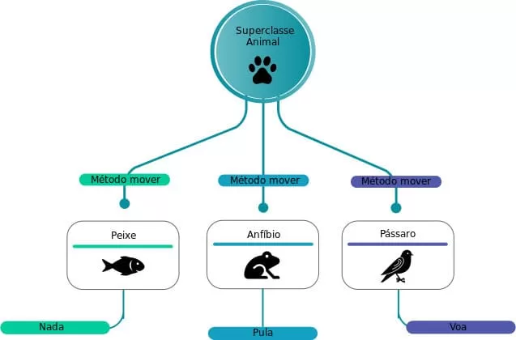

# 📘 Apostila 6 — Polimorfismo

## O que é polimorfismo
Polimorfismo é quando várias classes que vêm de uma mesma classe base usam métodos com o mesmo nome, mas cada uma faz isso do seu próprio jeito.

Ou seja, é como ter uma mesma “ação”, porém com comportamentos diferentes dependendo do objeto que está usando. O programa decide qual comportamento executar durante a execução.

Com o polimorfismo, você pode usar os mesmos métodos e atributos em objetos diferentes, mas cada objeto pode ter uma lógica própria para executar aquela ação.


## Como funciona o polimorfismo no Java
No Java, o polimorfismo acontece principalmente através de:

- Herança (extends)
- Sobrescrita de métodos (override)
- Interfaces (implements)
- Classe pai referenciando objetos filhos

A ideia principal é:

Uma variável do tipo da classe pai pode apontar para objetos das classes filhas.

Isso permite que o Java decida em tempo de execução qual método será executado.

## Exemplos de polimorfismo
Classe pai
```java
class Animal {
    public void fazerSom() {
        System.out.println("O animal faz um som");
    }
}
```

Classe filha cachorro
```java
class Cachorro extends Animal {
    @Override
    public void fazerSom() {
        System.out.println("O cachorro late");
    }
}
```

Classe filha gato
```java
class Gato extends Animal {
    @Override
    public void fazerSom() {
        System.out.println("O gato mia");
    }
}
```

Teste
```java
public class Main {
    public static void main(String[] args) {
        Animal cachorro = new Cachorro();
        Animal gato = new Gato();

        cachorro.fazerSom();
        gato.fazerSom();
    }
}
```

- Mesmo tipo de variável → Animal
- Objetos diferentes → Cachorro e Gato
- Métodos diferentes executados automaticamente



## Vantagens do polimorfismo
- Código mais limpo
- Evita if/else grandes
- Facilita manutenção
- Facilita expansão
- Reutilização de código
- Flexibilidade